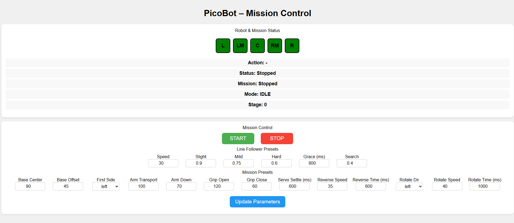

# picobot-mission-control


**Erasmus+ project ROBO STEAM ACADEMY** (KA220-VET-7CF4F308) — co-funded by the European Union — <https://robosteam.eu/>

Part of the **PicoBot Teachers' Toolkit** (lesson plans, student materials, slides and guides in five languages):
<https://github.com/robosteamdev/robo-steam-academy-teachers-toolkit>

**Object manipulation mission** for PicoBot: the robot follows a line to a marker and stops, picks up an object with
its arm, places it on the other side, drives back, turns 180°, follows the line back and stops at the start marker —
all by itself. A web page on the phone shows the sensors and the mission stage and holds all settings.



This is the educational project "manipulation of an object with the arm" of ROBO STEAM ACADEMY and the competition
category **Object Manipulation**.

## What you need

- A **PicoBot**: the mecanum-wheel robot with an arm of ROBO STEAM ACADEMY, built on the **Raspberry Pi Pico 2 W**
  (or Pico W). How to build it: <https://github.com/robosteamdev/picobot-setup> (assembly and hardware documents,
  test programs). Run the checks of picobot-setup first.
- **MicroPython** 1.25 or newer on the Pico (tested with 1.26.1) and **Thonny** (<https://thonny.org>) on the computer.
- A phone or laptop with Wi-Fi and a web browser.
- A **mission course**: a black line (black electrical tape) at least 1 m long on a white surface, with a **start
  marker** and an **end marker** — short strips of tape across the line that cover all five sensors — and a small
  object (e.g. a foam cube). For a competition, use the course sizes of the official rules.

## The files

| File | Where on the Pico | What it does |
|---|---|---|
| `main.py` | main folder | starts `PicoBot/picobot_main.py` when the robot is switched on |
| `PicoBot/picobot_main.py` | `PicoBot/` | the program: Wi-Fi access point, web page, line following and the mission state machine |
| `PicoBot/picobot.py` | `PicoBot/` | the `PicoBot` class (moves) |
| `PicoBot/picobot_motors.py` | `PicoBot/` | library: the four wheel motors (motor driver board, I2C on GP20/GP21) |
| `PicoBot/picobot_arm.py` | `PicoBot/` | library: the three servos of the arm (servo driver board, I2C on GP2/GP3), with safe angle limits |
| `PicoBot/pca9685.py` | `PicoBot/` | driver of the PCA9685 boards (used by the two libraries) |

## Copy the files to the Pico — keep the folder structure

Download the repository (**Code → Download ZIP**) and unpack it. Copy the files to the Pico **exactly as they are
arranged in the repository** (in Thonny: View → Files):

```text
Pico (/)
├── main.py              ← two lines: it starts PicoBot/picobot_main.py
└── PicoBot/
    ├── picobot_main.py
    ├── picobot.py
    ├── picobot_motors.py
    ├── picobot_arm.py
    └── pca9685.py
```

1. Upload `main.py` to the main folder (right-click → **Upload to /**).
2. In the **Raspberry Pi Pico** list, right-click an empty place → **New directory…** → `PicoBot`, and open it.
3. Select the files of the repository's `PicoBot` folder and choose **Upload to /PicoBot**.

Pictures, `LICENSE` and `README.md` are not needed on the robot.

## Give your robot its own Wi-Fi name

The robot creates its **own Wi-Fi network** (access point). Every robot with this program uses the same name, so
before a class uses several robots, each team changes it. Open `PicoBot/picobot_main.py` in Thonny and change

```python
ssid = 'picobot-prog'
```

to the team's own name, for example `ssid = 'picobot-prog-team3'`. The password is `12345678` (you may change it too; at
least 8 characters). Save the file.

## Start

1. Restart the robot: press **Ctrl+D** in Thonny's Shell, or switch the robot off and on with its batteries.
   The green LED of the Pico lights when the Wi-Fi network is ready.
2. Connect the phone or laptop to the robot's Wi-Fi network (password `12345678`, or your own).
3. Open **http://192.168.4.1/** in the browser — type it exactly, with `http://`.
4. Put the robot on the line at the start, set the values and press **START**; **STOP** stops it.

**The page** shows the five sensors **L, LM, C, RM, R**, the **Action**, **Status**, **Mission**, **Mode** and
**Stage**. After changing values, press **Update Parameters**.

*Line follower presets* — Speed 30, Slight 0.9, Mild 0.75, Hard 0.6, Grace 800 ms, Search 0.4 (as in
[picobot-line_following](https://github.com/robosteamdev/picobot-line_following)).

*Mission presets:*

| Setting | Meaning | Default |
|---|---|---|
| Base Center | base servo angle with the arm pointing forward | 90 |
| Base Offset | how far the base turns to each side (°) | 45 |
| First Side | side where the object is picked up; it is placed on the other side | left |
| Arm Transport / Arm Down | arm angle for carrying / for placing the object | 100 / 70 |
| Grip Open / Grip Close | gripper angle open / closed | 120 / 60 |
| Servo Settle (ms) | waiting time after each arm movement | 600 |
| Reverse Speed / Reverse Time (ms) | driving back after placing the object | 35 / 600 |
| Rotate Dir / Rotate Speed / Rotate Time (ms) | the turn of about 180° before the return | left / 40 / 1000 |

The reverse and rotate moves are timed: tune the times on your floor so the robot drives back about 10 cm and turns
180°.

If something does not work, see **A5 Troubleshooting** in the toolkit.

**Safety:** keep fingers away from the gripper while the mission runs; the safety officer of the team switches the
robot off in an emergency.

## In the toolkit

- Module **M10** Robot arm, session 20 (pick and place), and **M12** Capstone A, sessions 26–27 (planning the
  mission as a state machine, then build, test and tune), session 30 (team documentation).
- Video V3 "PicoBot object manipulation - pick up a cube and place it on a target" (the same task done by hand):
  <https://www.youtube.com/watch?v=MrGmpOJrRMA>
- A3 Software set-up (section 7), A5 Troubleshooting.

## Licence and credits

Code: MIT licence (see `LICENSE`). Please credit "ROBO STEAM ACADEMY, Erasmus+ project KA220-VET-7CF4F308" —
<https://robosteam.eu/>

Funded by the European Union. Views and opinions expressed are however those of the author(s) only and do not
necessarily reflect those of the European Union or the Human Resource Development Centre (HRDC). Neither the European
Union nor the granting authority can be held responsible for them.
